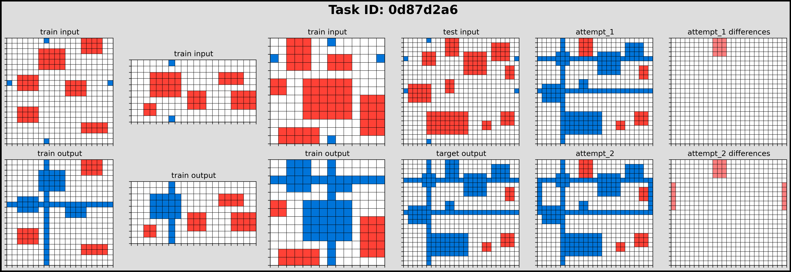

# GPT 2 XL Analysis

The difference in the residual data stream that the attention and MLP layers make. The closer the cosine similarity is to 1 the less the attention block has modified the activations - which is suboptimal. Ideally you want <0.9.

